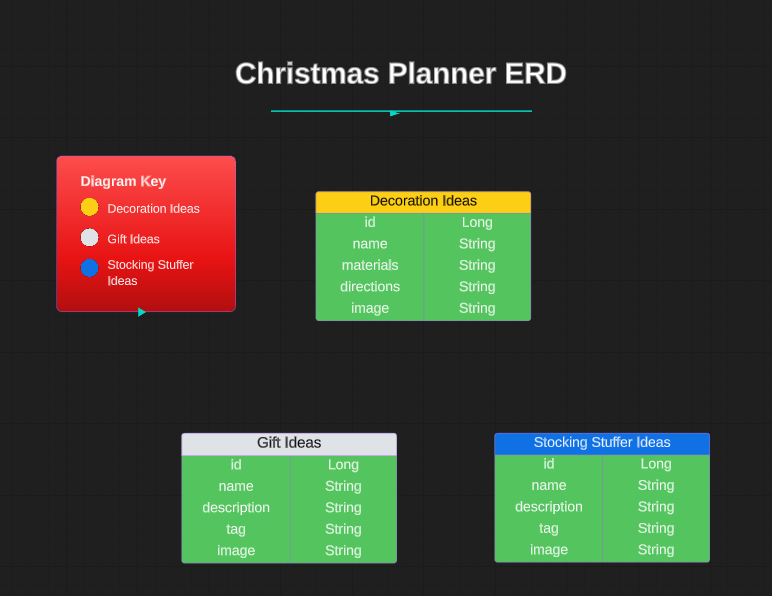

# Handmade Holidays Hub Front-End 

A DIY holiday inspiration application designed to allow users to find ideas and tutorials for DIY Christmas gifts, stocking stuffers, ornaments and decorations. Users are able to browse and add different ideas for DIY decorations, gifts, and stocking stuffers as they plan for Christmas. 

## Technologies Used

* Angular 
* TypeScript 
* HTML 
* CSS 
* VS Code 

## General Approach

I started off by creating my user stories and acceptance criteria. This helped me visualize my end goals and outline what I wanted to achieve with this project. I also created a spreadsheet of all my HTTP methods and API endpoints to keep track of which methods were supposed to hit which endpoint.

For the final step of the planning phase, I created an ERD (entity relationship diagram) to plan my different models and their relevant attributes. This helped me to visualize their individual tables and corresponding attributes in the database. 

Then, I built the back-end of the app, using Java, the Spring framework, and H2 Database to create a REST API. Finally, I did my API testing using MockMVC before moving on to create the front-end of the app. 

After creating a new Angular app for the front-end, I created my components, routes, and services, and connected the front-end to the back-end, before circling back to work on the styling.  

## Entity Relationship Diagram

## API Endpoints

| Request Type | URL                           | Functionality                        | Access   | 
|-----------|-------------------------------|--------------------------------------|----------|
| POST      | /api/decorations/             | Create a decoration idea             | Public   |
| GET       | /api/decorations/             | Get all decoration ideas             | Public   |
| GET       | /api/decorations/1/           | Get a decoration idea                | Public   |
| POST      | /api/gifts/                   | Create a gift idea                   | Public   |
| GET       | /api/gifts/                   | Get all gift ideas                   | Public   |
| GET       | /api/gifts/1/                 | Get a gift idea                      | Public   |
| POST      | /api/stockingstuffers/        | Creating a stocking stuffer idea     | Public   |
| GET       | /api/stockingstuffers/        | Get all stocking stuffer ideas       | Public   |
| GET       | /api/stockingstuffers/1/      | Get a stocking stuffer idea          | Public   |

## User Stories

<b>User Story 1:</b>
 
As a user I want to view a list of all Christmas decorating ideas so that I can browse for inspiration. (GET all Christmas decorating ideas)

<b>Acceptance Criteria:</b>
 
* User can search for all Christmas decorating ideas.
* Search results should display a list of all Christmas decorating ideas.

<b>User Story 2:</b>
 
As a user I want to view a specific Christmas decorating idea so that I can follow the tutorial and create the decoration. (GET Christmas decorating idea by id)

<b>Acceptance Criteria:</b>
 
* User can click a link from the main page of search results that will bring them to a page with that specific decoration. 

<b>User Story 3:</b>
 
As a user I want to add a new Christmas decorating idea so that I can share my decorating ideas with other users. (POST Christmas decorating idea)

<b>Acceptance Criteria:</b>
 
* User can add new Christmas decorating ideas, specifying the name, materials needed, directions, and the URL of an image showing the finished product. 
* User can save the Christmas decorating idea to the overall list of Christmas decorating inspiration.

<b>User Story 4:</b>
 
As a user I want to view a list of all gift ideas for inspiration for my Christmas shopping. (GET all gift ideas)

<b>Acceptance Criteria:</b>
 
* User can search for all gift ideas. 
* Search results should display a list of all gift ideas.

<b>User Story 5:</b>
 
As a user I want to view a specific gift idea for inspiration for my Christmas shopping. (GET gift idea by id)

<b>Acceptance Criteria:</b>
 
* User can click a link from the main page of search results that will bring them to a page with that specific gift. 

<b>User Story 6:</b>
 
As a user I want to add a new gift idea so that I can share my gift ideas with other users. (POST gift idea)

<b>Acceptance Criteria:</b>
 

* User can add new gift ideas, specifying the name, description, and the URL of an image showing the finished product. 
* User can save the gift idea to the overall list of gift ideas for inspiration.

<b>User Story 7:</b>
 
As a user I want to view a list of all the stocking stuffer ideas for inspiration for my Christmas shopping. (GET all stocking stuffer ideas)

<b>Acceptance Criteria:</b>
 
* User can search for all stocking stuffer ideas.  
* Search results should display a list of all stocking stuffer ideas.

<b>User Story 8:</b>
 
As a user I want to view a specific stocking stuffer idea for inspiration for my Christmas shopping. (GET stocking stuffer idea by id)

<b>Acceptance Criteria:</b>
 
* User can click a link from the main page of search results that will bring them to a page with that specific stocking stuffer. 

<b>User Story 9:</b>
 
As a user I want to add a new stocking stuffer idea so that I can share my stocking stuffer ideas with other users. (POST stocking stuffer idea)

<b>Acceptance Criteria:</b>
 
* User can add new stocking stuffer ideas, specifying the name, description, and the URL of an image showing the finished product.
* User can save the stocking stuffer idea to the overall list of stocking stuffer ideas for inspiration.

## Major Hurdles

The biggest hurdle was figuring out how to link the front-end (Angular) to the back-end (Java/Spring). I had routing issues on the front-end with all of my endpoints, which I was surprised by. Before starting this project, I thought that since the logic was already written on the back-end, that I wouldn't really have to do much on the front-end besides styling the pages and pointing towards the API on the back-end. Although the routing issues were definitely a major hurdle for me during this project, I was thankfully able to conquer them with some help from my instructors, Suresh and Leo, whom I've credited in my "Special Thanks" section below.  

## Post MVP 

I plan on continuing to work on this project in the future so that I can implement a PUT method for users to update existing data, as well as a search bar to filter the results for the gift and stocking stuffer models, depending on whether they are tagged as gift or stocking stuffer ideas for 'men', 'women', or 'children'/'kids'. I do intend on implementing these features in the near future so that I can see my vision truly realized. 

### Links

* Back-End - https://github.com/AyalaVirtual/ChristmasPlanner-BackEnd/ 

* User Stories - https://docs.google.com/document/d/1JO308vvk7BKkmmwOgG62_AT4C6tBEFypRaw2r9NPWPM/edit?usp=share_link

* API Endpoints Spreadsheet - https://docs.google.com/spreadsheets/d/12RVyZPDAlmanUx-98VLKu9mCzgStWquStDJq75A0pes/edit?usp=sharing

* ERD (entity relationship diagram) - https://lucid.app/lucidchart/3af0981c-1f3f-40a1-b08e-08b9ec132565/edit?viewport_loc=-571%2C-19%2C3437%2C1426%2C0_0&invitationId=inv_71e906c4-a567-48ff-9051-3689be6f57a8

### Special Thanks

* Leonardo Rodriguez - my instructor who not only taught me all the concepts used to build the front-end of this project (including HTML, CSS, TypeScript, and Angular), but also helped me conquer the issues with routing, which turned out to be a major hurdle for me in this project. He helped me spot several errors that were keeping my code from working as intended and helped write the solution to work around the routing issues for the GET and POST methods. [GitHub](https://github.com/LRodriguez92) 

* Suresh Sigera - my instructor who taught me all the concepts used to build the back-end of this project, including Java, the Spring framework, and API testing tools such as Postman, MockMVC, and REST-Assured / Cucumber. [GitHub](https://github.com/sureshmelvinsigera)

### Author

:woman_technologist: Erica Ayala

* [LinkedIn](https://www.linkedin.com/in/ayalavirtual)

* [GitHub](https://www.github.com/AyalaVirtual) 

